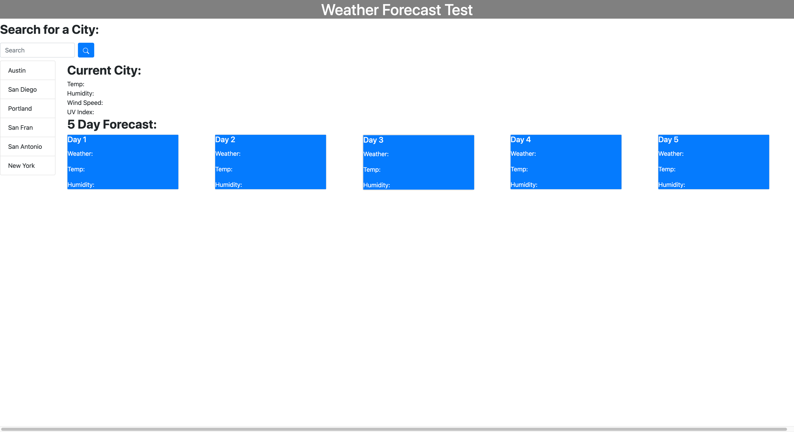

I've created a weather forecast that will show the current day, as well as the next five day forecast for any city you enter. The current day will show the city name, temperature, humidity, and UV Index, and the five day forecast will show the date, an icon depicting the weather conditions, temperature, and humidty. It will save the cities in local storage which can be easily accessed by the user to the left, underneath the, "Search for a City:" section.

The languages used for this project were HTML, CSS, and Javascript. The framework is Bootstrap.

https://mbubel.github.io/weatherforecast-week6/

Page on Initial Load: 
Page after User inputs information:  

License
MIT License Copyright (c) 2020 Michael Bubel. Permission is hereby granted, free of charge, to any person obtaining a copy of this software and associated documentation files (the "Software"), to deal in the Software without restriction, including without limitation the rights to use, copy, modify, merge, publish, distribute, sublicense, and/or sell copies of the Software, and to permit persons to whom the Software is furnished to do so, subject to the following conditions: The above copyright notice and this permission notice shall be included in all copies or substantial portions of the Software. THE SOFTWARE IS PROVIDED "AS IS", WITHOUT WARRANTY OF ANY KIND, EXPRESS OR IMPLIED, INCLUDING BUT NOT LIMITED TO THE WARRANTIES OF MERCHANTABILITY, FITNESS FOR A PARTICULAR PURPOSE AND NONINFRINGEMENT. IN NO EVENT SHALL THE AUTHORS OR COPYRIGHT HOLDERS BE LIABLE FOR ANY CLAIM, DAMAGES OR OTHER LIABILITY, WHETHER IN AN ACTION OF CONTRACT, TORT OR OTHERWISE, ARISING FROM, OUT OF OR IN CONNECTION WITH THE SOFTWARE OR THE USE OR OTHER DEALINGS IN THE SOFTWARE.
